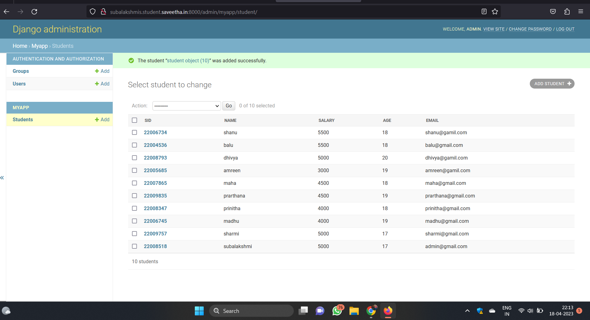

# Ex02 Django ORM Web Application

## AIM
To develop a Django application to store and retrieve data from a student database using Object Relational Mapping(ORM).

## Entity Relationship Diagram


## DESIGN STEPS

### STEP 1:

Clone the repository from the github

### STEP 2:

create an admin interface for django.

### STEP 3:

create an app and edit settings.py

### STEP 4:

make migrations and migrate the changes.

### STEP 5:

create admin user and write python code for admin and models.

### STEP 6:

make all the migrations to 'myapp'.

### STEP 7:

create an student database with 10 fields using runserver command.

## PROGRAM
```
admin.py
from django.contrib import admin
from .models import student,studentAdmin
admin.site.register(student,studentAdmin)

models.py
from django.db import models
from django.contrib import admin
class student(models.Model):
    sid=models.CharField(max_length=200)
    name=models.CharField(max_length=100)
    salary=models.IntegerField()
    age=models.IntegerField()
    email=models.EmailField()

class studentAdmin(admin.ModelAdmin):
    list_display=('sid','name','salary','age','email')


```

## OUTPUT



## RESULT
 
 The program for running a student database using ORM is successfully exceuted
